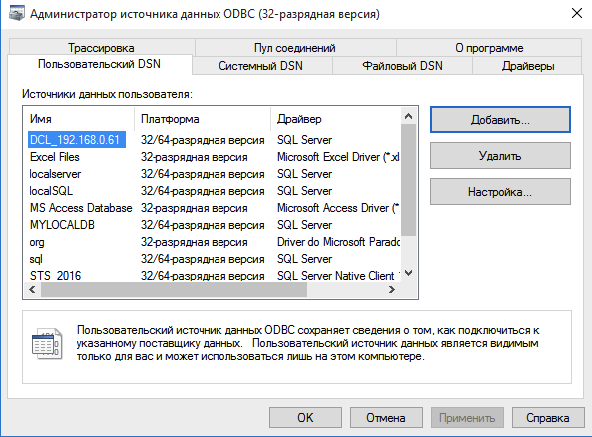

# Перенос базы программы ВЭД-Склад из Pardox в SQL-Server

В данной инструкции рассмотрен порядок переноса базы данных программы ВЭД-Склад в SQL-Server. Для корректной работы подойдет любая версия программы SQL Server начиная с версии 2008 и выше. Порядок установки и настройки SQL Server в данной статье не рассмотрен, с ним вы можете частично ознакомится в данной инструкции  [Перенос базы ВЭД-Декларант (Монитор ЭД) в MS SQL Server](https://ed2inteh.ru/support/manual/sql-server-migrate/)

Важно при установки задать имя пользователя и пароль, который затем будет использоваться для доступа к серверу. 

### Создание базы

Средствами SQL Server Создать базу с именем sts. Пример создания с помощью Management Studio показан на картинке ниже.


При необходимости создать в SQL Server отдельного отдельных пользователя для работы с базой sts.


### Настройка рабочего места. Создние ODBC DSN для драйвера "SQL Server"

1. Зайти в Панель управления - Администрирование - Источники данных ODBC 


2. На вкладке "Пользовательский DSN" нажать кнопку "Добавить" 


3. Выбрать источник данных "SQL Server" и нажать кнопку "Готово"


4. Задать имя (например, sts_dsn) и имя SQL сервера. Сервер может быть вида  <название компьютера>\<имя экземпляра> или <название компьютера>   (например 192.168.0.1\sqlexpress ) и нажать кнопку "Далее"


5. Задание типа аутентификации SQL Server. В окне задать имя пользователя и пароль, определенные при создании базы данных или установке SQL Server. В данном примере мы использовали имя суперпользователя sa. Нажать "Далее"


6. Все остальные параметры оставить по умолчанию. Нажать "Далее"


### Настройка программы ВЭД-Склад

1. В программе ВЭД-Склад зайти в меню Сервис-База Данных-Преобразование базы данных

2.  В строке «База данных (Paradox)» указывается путь к БД программы ВЭД-Склад. По умолчанию предлагается путь текущей БД, т.е. той, на которую настроена программа (поддиректория DATA каталога установки программы).

В строке «Тип СУБД» из выпадающего списка необходимо выбрать формат БД, в которую Вы хотите выполнить преобразование, в нашем случае SQL server.

 В строке «Имя БД» указать имя базы данных (sts), в строке «Сервер» указать имя созданного DSN (sts_dsn), «Пользователь» и «Пароль» заданные в пункте 5 пользователь и пароль. 
 

3. Нажать кнопку "Выполнить" 
 

4. В программе ВЭД-Склад зайти в меню Сервис-Настройка-База данных
 

5. На вкладке "База данных" указать драйвер "SQL Server" и в поле ODBC DSN имя созданного DSN, в поле "Имя баз данных" - sts, пользователь и пароль в соответствующие поля.
 

### Настройка сортировки

Сортировка при работе с серверными СУБД отключена. Для сортировки необходимо в программе ВЭД-Склад зайти Сервис-Настройка-Книга Учета и указать выражение сортировки
```
FDT('YYYYMMDD', KRD_MAIN.BD_DATE)+LEFTPAD(KRD_MAIN.STORE_DOC_NO, 30, " ")
```
 

Зайти в меню Документ-Обработка-Произвольная-Добавить и выполнить следующий [скрипт](resortin.prd)
 