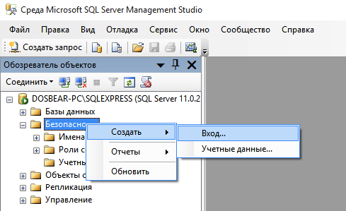

# Перенос базы программы ВЭД-Склад из Pardox в SQL-Server

В данной инструкции рассмотрен порядок переноса базы данных программы ВЭД-Склад в SQL-Server. Для корректной работы подойдет любая версия программы SQL Server начиная с версии 2008 и выше. Порядок установки и настройки SQL Server в данной статье не рассмотрен, с ним вы можете частично ознакомится в данной инструкции  [Перенос базы ВЭД-Декларант (Монитор ЭД) в MS SQL Server](https://ed2inteh.ru/support/manual/sql-server-migrate/)

Важно при установки задать имя пользователя и пароль, который затем будет использоваться для доступа к серверу. 

### Создание базы

Средствами SQL Server Создать базу с именем sts. Пример создания с помощью Management Studio показан на картинке ниже.

При необходимости создать в SQL Server отдельного отдельных пользователя для работы с базой sts.

### Настройка рабочего места 
Создние ODBC DSN для драйвера "SQL Server"
1. Зайти в Панель управления - Администрирование - Источники данных ODBC 

2. На вкладке "Пользовательский DSN" нажать кнопку "Добавить" 

3. Выбрать источник данных "SQL Server" и нажать кнопку "Готово"

4. Задать имя (например, sts_dsn) и имя SQL сервера. Сервер может быть вида  <название компьютера>\<имя экземпляра> или <название компьютера>   (например 192.168.0.1\sqlexpress ) и нажать кнопку "Далее"

- Задать тип аутентификации SQL Server. Задать имя пользователя и пароль.
-Все остальные параметры оставить по умолчанию.

2. Выполнить преобразование базы данных(В ВЭД-Склад меню Сервис-База Данных-Преобразование базы данных)

  - В строке «База данных (Paradox)» указывается путь к БД программы ВЭД-Склад. По умолчанию предлагается путь текущей БД, т.е. той, на которую настроена программа (поддиректория DATA каталога установки программы).
  - В строке «Тип СУБД» из выпадающего списка необходимо выбрать формат БД, в которую Вы хотите выполнить преобразование, в нашем случае SQL server.
  - В строке «Имя БД» указать имя базы данных (STS2011), в строке «Сервер» указать имя  созданного DSN (sts), «Пользователь» и «Пароль» заданные в пункте 2.2 пользователь и пароль.

3. В настройках программы(Сервис-Настройка-База данных) указать драйвер "SQL Server" и в поле Сервер указать имя созданного DSN, нажать "Дополнительно". В "База данных" - sts2021, пользователь и пароль, как в пункте 1

5. ~~Добавить в sts.ini в секцию [Database] параметр FreezeCalcFields=0~~
~~Это позволит включить вычисляемые поля (для серверов БД).~~

6. Сортировка при работе с серверными СУБД отключена.

Можно установить нужное выражение сортировки в настройке, а затем выполнить прилагаемый скрипт [resortin.prd](resortin.prd) через Обработку документов-Произвольная...

Т.к. сортировка отключена, все новые документы и измененные документы будут находиться вверху книги учета, для более-менее нормального вида книги и сохранения сортированного порядка "от новых документам к старым" в книге учета, попробуйте изменить выражение сортировки в книге учета, в меню настройка-книга учета-выражение сортировки укажите

FDT('YYYYMMDD', KRD_MAIN.BD_DATE)+LEFTPAD(KRD_MAIN.STORE_DOC_NO, 30, " ").

### Перенос журналов

 